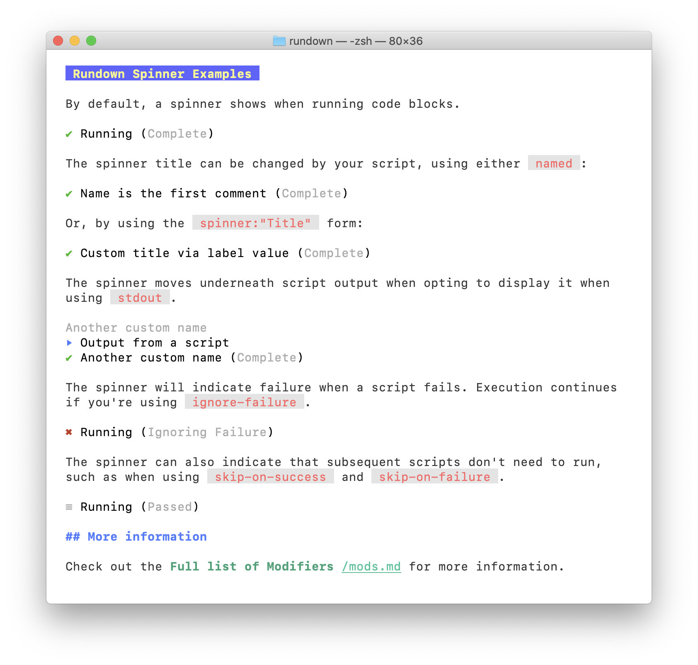

# Rundown <r label="rundown:help"/>

Rundown provides automation to Markdown. In the simplest case, this allows you to render Markdown documentation in the console, executing code blocks as Rundown progresses. It also provides more advanced useage documented below. 

Rundown's philosophy is that executable documentation is always better, but it shouldn't get in the way of just reading the document itself. 

Some of the usecases rundown suits are:

* Automated setup guides
* Tutorials
* Code building scripts
* Simple programs
* Operational support scripts


<r stop-ok/>

## Feature Highlights

Rundown will run unmodified markdown perfectly fine. As your rundown files get more complex, you'll want to start using the rundown automation tags. These tags are transparent additions to the markdown format which aren't rendered by standards compliant markdown renderers (i.e. Github, etc). See [Renderer Support](./docs/renderer_support.md) for more information.

[Read the Full documentation](./docs/automation_tags.md), or checkout the examples linked below.

Some of the additions Rundown brings are:

* [Shortcodes](./examples/shortcodes.md), which allow you to only run portions of a markdown file.
* Fenced code block execution and progress indicator [manipulation](./examples/mods.md).
* Optional failure handling, script skipping, and STDOUT presentation.
* First-class [emoji](./examples/emoji.md) support either via UTF characters, or :rocket: (`:rocket:`) syntax.
* [Invisible blocks](./examples/hidden.md), which are only rendered inside markdown and ignored by web based renderers.
* Visually appealing console markdown rendering, with support for images.
* [Shebang support](./examples/shebang-repeat.md), allowing you to make your markdown files executable.
* Rundown files can be designed to execute top to bottom, or present a menu to execute only a single part.
* Fast - rundown is written in Go, and works on Linux and Mac. Windows support via WSL probably works.

## Rundown Examples <r label=examples/>

At it's core, Rundown turns markdown's fenced code blocks into executable code. Indented code blocks are left as-is, as illustrated by this example.

    # Simple Markdown File

        This is a code block, it will be rendered to the console.
    
    ``` bash
    echo "This is a fenced code block, it will be executed"
    ```

When running fenced code blocks, rundown by default will hide the output and display a spinner indicating that it's running. It will update the spinner on completion of the process to either successful or failure. Failures terminate rundown unless you specify otherwise.



By default, a fenced code block which doesn't specify a language will be rendered out instead of executed.

    ```
    This is a simple fenced code block, it won't be executed.
    ```

```
This is a simple fenced code block, it won't be executed.
```

However, if you specify the syntax, then rundown will execute that file, and show a spinner as the execution progresses. [Modifiers Example](./examples/mods.md) allow you to change this behaviour.

    ``` bash
    sleep 1
    ```

``` bash
sleep 1
```

Rundown's own build file is a good example of what you can accomplish with Rundown. Take a look at [build.md](./build.md).

A full list of the modifiers and examples can be found in the [Modifiers Example](./examples/mods.md) markdown file.

## Handling Errors

When using `bash`, fenced code blocks run with `set -euo pipefail`, so most errors will fail the running script. For other interpreters and shells, a non-zero exit code is considered a failure.

When there's no special failure handling, all failures will cause Rundown to exit and provide an error trace.


Take a look at the [Failure exampes](./examples/failure.md).

## Shortcodes <r label=shortcodes>

Headings can have "shortcodes" attached to them, which allows that heading (and all child headings) to be executed specifically. Specifying a shortcode can be done either before the heading, or inside the heading itself.

``` markdown reveal norun
## Shortcodes <r label=shortcodes/>
```

That heading can then be run via `rundown README.md shortcodes`. Bash/Fish/ZSH completition is available for shortcodes, as well as a shortcode subcommand which lists available shortcodes within a document.

Related to shortcodes is the `setup` flag. It's common to write instructions where every level 2 heading runs under the assumption that something from the parent heading has been done. The setup flag on a code block means that any shortcodes on child headings should also run the parent code blocks with the `setup` flag present.

For example:

    # Build Project

    Make sure you've set your architecture correctly.

    ``` bash env setup
    export GO_ARCH=linux
    ```

    ## Compile <r label=build/>

    ``` bash
    go build -o rundown
    ```

When you execute `rundown README.md compile`, rundown will first execute the parent heading's ("Build Project") `setup` code blocks.

### Options

Shortcodes support options, which are variables you can pass into your rundown scripts. Passing options into Rundown is done via the command line:

``` bash norun reveal
rundown README.md shortcode +option="Value"
```

Options always come after the shortcode, must be prefixed with a `+` symbol, and must be of the format key=value. Option tags are ignored unless they specify `opt`, `type` and `desc`.

    ## Compile <r label=build/>

    <r opt="arch" type="string" required default="linux" desc="Specify the architecture"/>

    ``` bash
    GO_ARCH=$OPT_ARCH go build -o rundown
    ```

To invoke this:

``` bash reveal norun
rundown README.md build +arch=linux
```

More examples can be found in the [Shortcodes Example](./examples/shortcodes.md) markdown file.

## Functions <r label=functions/>

While Shortcodes allow users to jump to certain points of your document, **Functions** allow authors to pull in functionality from elsewhere in the document, or even another document entirely.

This can serve to clean up read-throughs of your rundown documents, as well as provide a modules-like functionality to larger Rundown scripts.

### Defining a function

A function is defined similiarly to shortcodes, via the `Heading`:

~~~ markdown reveal norun
# Wait for Status <r func="k8s:wait"/>

<r opt="condition" type="string" default="ready" required desc="The condition to wait for"/>
<r opt="app-name" type="string" required desc="The name of the app"/>

Waiting for app <r sub-env>$OPT_APP_NAME</r> to have condition of <r sub-env>`$OPT_CONDITION`</r>.

``` bash spinner:"Waiting..."
kubectl wait --for=condition=$OPT_CONDITION pod -l app=$OPT_APP_NAME
```
~~~

A function can then be invoked using the `invoke` attribute on the rundown tag. The contents of the rundown tag will be displayed for readers, but rundown will instead display the function's contents.

``` markdown reveal norun
<r invoke="k8s:wait" opt-app-name="my-cool-app">Then wait for your pods to be ready</r>
```

More examples can be found in the [Functions Example](./examples/functions.md) markdown file.

